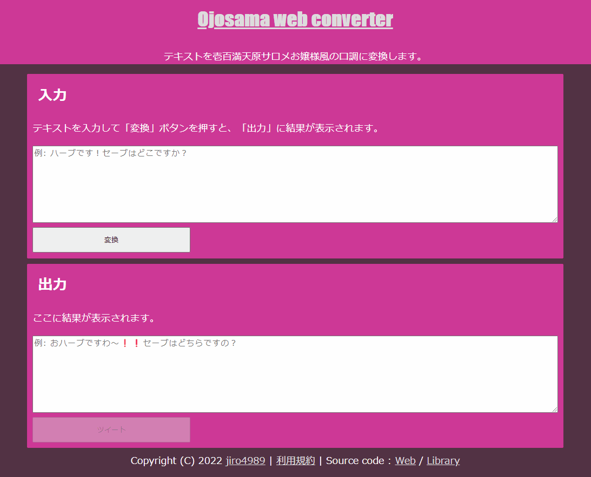

= ojosama-web
:sectnums:
:toc: left

テキストを壱百満天原サロメお嬢様風の口調に変換するWebアプリです。

== 概要

テキストを壱百満天原サロメお嬢様風に変換する自前のライブラリ
https://github.com/jiro4989/ojosama[ojosama] を使って作ったWebアプリです。

実行環境はHerokuです。以下URLからアクセスできます。

* https://ojosama.herokuapp.com

== 壱百満天原サロメお嬢様について

以下を参照してください。

* https://www.nijisanji.jp/members/salome-hyakumantenbara[壱百満天原サロメ - にじさんじ公式サイト]
* https://twitter.com/1000000lome[壱百満天原サロメ - Twitter]

== 使い方

=== Web

「入力」にテキスト入れて「変換」ボタンを押すだけです。

=== API

APIとしても使えるようにしてます。

[source,bash]
----
$ curl -X POST -H 'Content-Type: application/json' -d '{"Text":"これはハーブです！"}' https://ojosama.herokuapp.com/api/ojosama
{"Result":"これはおハーブですわ～！"}
----

API仕様は以下資料を確認してください。

* https://jiro4989.github.io/ojosama-web/swagger.html

== 動作環境

最低限以下の環境で動作確認をしています。

* PC
** Google Chrome 最新
* Android
** Google Chrome 最新

それ以外の環境は動作確認していませんが、
素のHTMLとJSと単純なCSS設定しかしていないので多分動くと思います。(淡い期待)
まぁ多少レイアウトが崩れていても変換機能は動くはずなので許してください。

なお、Internet Explorerはサポート外です。

== 注意事項

=== プログラムの使用について

壱百満天原サロメお嬢様、及びその所属の にじさんじ や、
その関係者、ファンコミュニティの方の迷惑にならないように使ってください。

本プログラムは、にじさんじ所属の壱百満天原サロメお嬢様のキャラクターを題材にした二次創作の一つです。
故に、本プログラムは以下二次創作ガイドラインに従います。

* https://event.nijisanji.app/guidelines/[ANYCOLOR二次創作ガイドライン]

本プログラムを使う場合も上記ガイドラインを守ってお使いください。

== 開発者向け

=== 前提条件

* Go 1.18.2
* Ubuntu 22.04 on Docker
* https://devcenter.heroku.com/ja/articles/heroku-cli[Heroku CLI]
* make

=== アプリ構成

フロントはGoのhtml/template + HTML + JSだけで書いてます。
依存パッケージ管理が面倒なので、npmを導入する予定はありません。

バックエンドはGoの https://echo.labstack.com[echo] を使ってます。

フロントからJSでAPIサーバに対してAPIリクエストを出して、結果を貼り付けてるだけです。
なので、前述の通り API としても使える作りになってます。

=== 環境構築

Heroku CLIをセットアップします。

[source,bash]
----
curl https://cli-assets.heroku.com/install.sh | sh
----

=== ビルド

以下のコマンドでビルドします。
単体テストはありません。

[source,bash]
----
make
----

=== 疎通確認

[source,bash]
----
make ping

# herokuの方
make ping ENV=prd
----

=== デプロイ

[source,bash]
----
heroku login
heroku stack:set container
make deploy
----

=== 参考

* https://devcenter.heroku.com/ja/articles/git[Gitを使用したデプロイ]
* https://devcenter.heroku.com/ja/articles/build-docker-images-heroku-yml[heroku.ymlを使用してDockerイメージをビルドする]

=== その他

デザインとかさっぱり分からないんで、UI改善PRをお待ちしてます・・・
